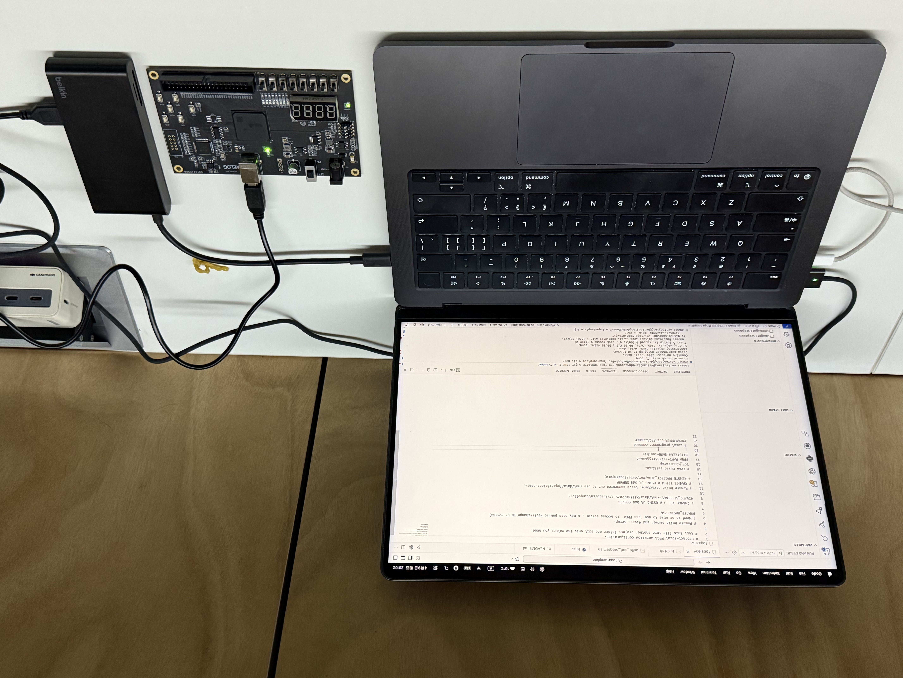
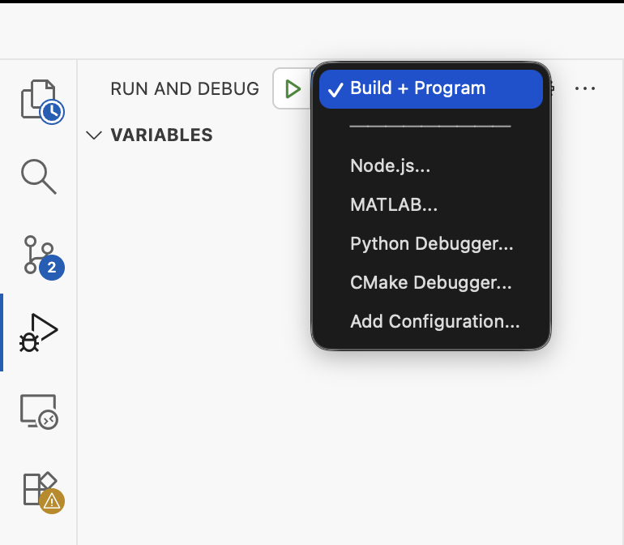

# FPGA 模板项目

这是一个可复用的 FPGA 项目模板，适用于电子系《数字逻辑处理器基础实验》课程、本地 `macOS + VSCode` 开发。流程如下：**（其中 2、3、4、5、6 由脚本自动完成）**

1. 在本地编写 Verilog 和 XDC。
2. 将工程同步到远端 Linux 服务器。
3. 在远端通过 Vivado batch 模式生成 bitstream。
4. 将 bitstream 和构建日志下载回本地。
5. 在本地使用 `openFPGALoader` 给 FPGA 板烧录。
6. 自动从日志中提取关键信息并生成摘要文件。

## 硬件配置

本项目针对《数字逻辑与处理器基础实验》采用的开发板 WELOG1（型号为 `xc7a35tfgg484-2`）开发。我的硬件配置为 14 英寸 MacBook Pro (M5) 和贝尔金拓展坞，理论上任何不太老的 Mac 电脑都可以正常使用。



## 安装与使用

0. STAR 此项目 *（非必须）*

### 服务器准备（如果你有服务器）

> [!TIP]
> 如果你没有服务器：
> 1. 如果你和我很熟，可以找我借用我的服务器，但不保证可用性和稳定性。
> 2. 如果是电子系 2025 级以后的同学，我们计划在 FREEBBS 中为大家部署 Vivado，敬请期待。

1. 准备一台 x86_64 Linux 服务器（推荐 Ubuntu 22/24），并确保可以通过 SSH 登录：
```bash
ssh <user>@<host>
```
2. 挂载数据盘（用于安装 Vivado 和工程）：
```bash
sudo mkfs.ext4 /dev/vdc
sudo mkdir -p /mnt/data
sudo mount /dev/vdc /mnt/data
```
设置开机自动挂载：
```bash
sudo vim /etc/fstab
```
添加：
```bash
/dev/vdc  /mnt/data  ext4  defaults  0  0
```
3. 设置目录权限：
```bash
sudo chown -R $USER:$USER /mnt/data
```
4. 下载并安装 Vivado（Linux 版本）。建议在本地下载 `.bin` 安装包后上传到服务器。
上传：
```bash
scp FPGAs_AdaptiveSoCs_Unified_SDI_2025.2_*.bin <user>@<host>:/mnt/data
```
5. 解压安装器：
```bash
cd /mnt/data
chmod +x *.bin
./FPGAs_AdaptiveSoCs_Unified_SDI_*.bin --noexec --target xilinx_installer
cd xilinx_installer
```
6. 生成安装配置：
```bash
./xsetup -b ConfigGen
```
配置文件位置：
```bash
~/.Xilinx/install_config.txt
```
7. 修改安装配置（最小安装）：
```bash
vim ~/.Xilinx/install_config.txt
```
修改为：
```bash
Edition=Vivado ML Standard
Product=Vivado
Destination=/mnt/data/Xilinx

Modules=Artix-7 FPGAs:1
```
8. 执行安装：
```bash
./xsetup --batch Install \
  --config ~/.Xilinx/install_config.txt \
  -a XilinxEULA,3rdPartyEULA
```
9. 配置环境变量：
```bash
echo 'source /mnt/data/Xilinx/2025.2/Vivado/settings64.sh' >> ~/.bashrc
source ~/.bashrc
```
10. 验证安装：
```bash
vivado -mode tcl
```
出现：
```text
Vivado%
```
即表示安装成功。

11. 创建 FPGA 工作目录：
```bash
sudo mkdir -p /mnt/data/fpga
sudo chown -R $USER:fpga /mnt/data/fpga
sudo chmod -R 2775 /mnt/data/fpga
```

### 本地准备

1. 在本地安装 `openFPGALoader`：
```bash
brew install openFPGALoader
```
2. 克隆此项目：
```bash
git clone https://github.com/CBDT-JWT/fpga-template.git
cd fpga-template
```
3. 在 VSCode 中打开文件夹：
```bash
code .
```
4. 修改 `fpga.env`。
5. 点击左侧 `Run and Debug` 图标并选择 `Build + Program`，等待即可。若一切正常，则会看到 LED1 以约 1 Hz 闪烁。
6. 构建完成后，到 `build/build_summary.txt` 查看自动整理出的关键信息。



## 目录结构

- `rtl/`：Verilog 源文件
- `constr/`：XDC 约束文件
- `scripts/`：构建与辅助脚本
- `build/`：本地产生的构建产物、日志与摘要文件
- `.vscode/`：VSCode 的任务与运行配置
- `fpga.env`：项目级配置文件

## 配置说明

主要配置项位于 `fpga.env`：

- `REMOTE_HOST`
- `VIVADO_SETTINGS`
- `REMOTE_PROJECT_DIR`
- `TOP_MODULE`
- `FPGA_PART`
- `BITSTREAM_NAME`
- `PROGRAMMER`

如果将 `REMOTE_PROJECT_DIR` 保持为注释状态，脚本会默认使用：

`/mnt/data/fpga/<当前文件夹名>`

## 日志摘要

`Build + Program` 现在会自动生成以下文件：

- `build/vivado.log`：远端 Vivado batch 输出日志
- `build/program.log`：本地 `openFPGALoader` 检测与烧录日志
- `build/build_summary.txt`：从日志中提取的关键信息摘要

摘要文件会整理这些内容：

- Vivado 版本
- 目标器件
- 综合、布局布线、bitstream 生成是否成功
- 最终 timing 关键信息
- 错误、严重警告、警告数量
- 烧录检测与结果信息

## 复用模板

如果你想把这套流程复制到其他项目目录，可以执行：

```bash
./scripts/init_project.sh /path/to/new_project
```

这会创建一个新的工程目录，并自动生成同样的 workflow 文件。
